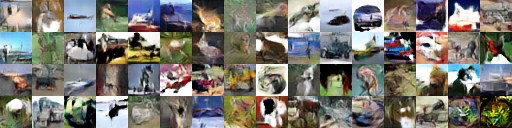

# Generative Adversarial Notebooks
## Collection of my Generative Adversarial Network implementations

Most codes are for python3, most notebooks works on CIFAR10

### WGAN
* wgan-keras: Wasserstein GAN  Keras implementation
* wgan-lasagne: Wasserstein GAN Lasagne implementation
* wgan-torch: Wasserstein GAN pytorch implementation based on https://github.com/martinarjovsky/WassersteinGAN

### WGAN2 (improved WGAN/WGAN-gp)
* wgan2-lasagne:  improved WGAN Lasagne implementation
* wgan2-keras: improved WGAN Keras implementation
* wgan2-lasagne-anime: WGAN on anime face images, lasagne
### WGAN2 sample results

### InfoGAN 
* mnist-infogan: InfoGAN Lasagne on MNIST dataset
* mnist-infogan-paper-uniform: InfoGAN Lasagne on MNIST dataset (fllowing the paper implementation)
### InfoGAN sample results

### DCGAN
* dcgan-lasagne: DCGAN in Lasagne
### DCGAN sample results

